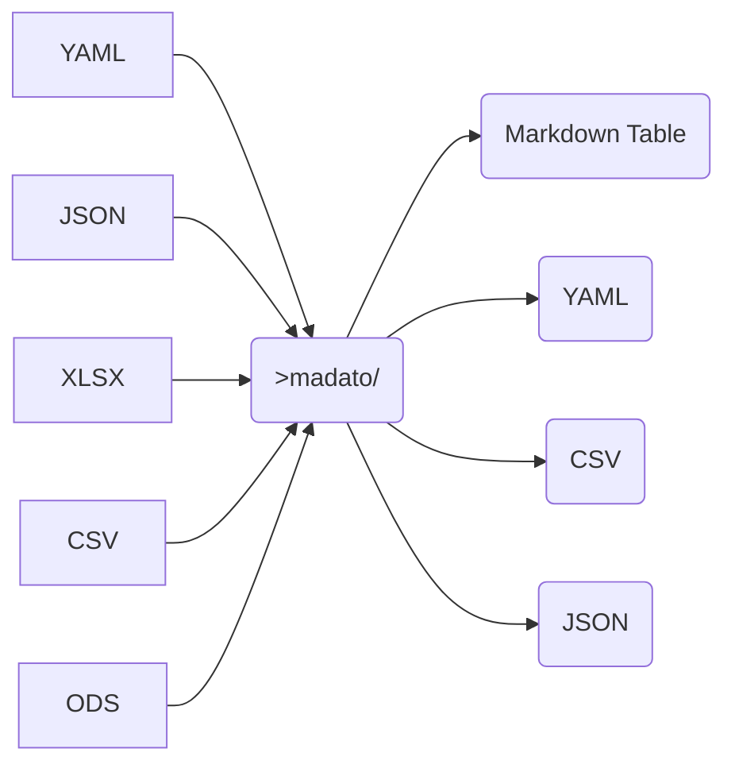

# madato &emsp; ![Build Status] [![Latest Version]][crates.io]

[Build Status]: https://github.com/inosion/madato/actions/workflows/publish.yml/badge.svg
[Latest Version]: https://img.shields.io/crates/v/madato.svg
[crates.io]: https://crates.io/crates/madato

***madato is a CLI and library, in rust and python for generating Markdown***

Windows, Mac and Linux

It converts CSV, YAML, JSON, XLSX and ODS Spreadsheets to
- JSON
- YAML
- CSV
- Markdown (Tables)

## TL;DR

* **Python**
  ```
  pip install madato
  ```

  ```python
  import madato
  print(madato.spreadsheet_to_md("path/to/your/spreadsheet.xlsx"))
  print(madato.spreadsheet_to_md("path/to/your/spreadsheet.ods"))
  print(madato.yaml_to_md("path/to/your/data.yaml"))
  print(madato.json_to_md("path/to/your/data.yaml"))
  ```

  For the full Python API, see

* **Command Line**
  Download the latest [github - madato - releases](https://github.com/inosion/madato/releases);

  ```sh
  madato table -t XLSX -o JSON --sheetname Sheet2         path/to/workbook.xlsx
  madato table -t XLSX -o MD   --sheetname Sheet2         path/to/workbook.xlsx
  madato table -t XLSX -o YAML --sheetname 'Annual Sales' path/to/workbook.xlsx
  madato table -t XLSX -o YAML path/to/workbook.ods
  madato table -t YAML -o MD   path/to/workbook.yaml
  madato table -t JSON -o MD   path/to/data.json
  madato table -t XLSX -o CSV  path/to/workbook.xlsx
  madato table -t CSV  -o MD   path/to/csv_file.csv
  ```

* **Rust Library**
  ```
  cargo add madato
  ```


## Details

The tools is primarly centered around getting tabular data (spreadsheets, CSVs) into Markdown.

It supports:
The following



## Filtering
* Spreadsheets have sheets (ODS and XLSX) so you can choose a sheet, or all.
* Regardless of the input format, you can
  - Filter the Rows using basic Regex over Key/Value pairs
  - Limit the output columns to named headings (again using a regex)
  - Re-order the columns, or repeat them using the same column feature

## Published as
- Command Line Tool (Windows, Mac, Linux) - good for CI/CD pre and post processing (reports etc)
- Rust Library - Good for integration into Rust Markdown tooling
- A Python library

## Data Considerations

Madato will co-erce every column in the heading row to have a value; that is, the first row are headings/column names
and if a cell in that first row is blank, it will create `NULL0..NULLn` entries as required.

## Examples

* Extract the `3rd Sheet` sheet from an MS Excel Document
```shell
> madato table --type xlsx test/sample_multi_sheet.xlsx --sheetname "3rd Sheet"
|col1|col2| col3 |col4 |                         col5                          |NULL5|
|----|----|------|-----|-------------------------------------------------------|-----|
| 1  |that| are  |wider|  value ‘aaa’ is in the next cell, but has no heading  | aaa |
|than|the |header| row |       (open the spreadsheet to see what I mean)       |     |
```

* Extract and reorder just 3 Columns
```shell
> madato table --type xlsx test/sample_multi_sheet.xlsx --sheetname "3rd Sheet" -c col2 -c col3 -c NULL5
|col2| col3 |NULL5|
|----|------|-----|
|that| are  | aaa |
|the |header|     |
```
* Pull from the `second_sheet` sheet
* Only extract `Heading 4` column
* Use a Filter, where `Heading 4` values must only have a letter or number.

```shell
> madato table --type xlsx test/sample_multi_sheet.xlsx --sheetname second_sheet -c "Heading 4" -f 'Heading 4=[a-zA-Z0-9]'
|        Heading 4         |
|--------------------------|
|         << empty         |
|*Some Bolding in Markdown*|
|   `escaped value` foo    |
|           0.22           |
|         #DIV/0!          |
|  “This cell has quotes”  |
|       😕 ← Emoticon       |
```

* Filtering on a Column, ensuring that a "+" is there in `Trend` Column

```
> madato table --type xlsx test/sample_multi_sheet.xlsx --sheetname Sheet1 -c Rank -c Language -c Trend -f "Trend=\+"
|                         Rank                         |  Language  |Trend |
|------------------------------------------------------|------------|------|
|                          1                           |   Python   |+5.5 %|
|                          3                           | Javascript |+0.2 %|
|                          7                           |     R      |+0.0 %|
|                          12                          | TypeScript |+0.3 %|
|                          16                          |   Kotlin   |+0.5 %|
|                          17                          |     Go     |+0.3 %|
|                          20                          |    Rust    |+0.0 %|
```

## Internals
madato uses:
- [calamine](https://github.com/tafia/calamine) for reading XLS and ODS sheets
- [wasm bindings](https://github.com/rustwasm/wasm-bindgen) to created JS API versions of the Rust API
- [PyO3]() and [Maturin] for publishing the Python.
- [regex]() for filtering, and [serde]() for serialisation.

## Tips

* I have found that copying the "table" I want from a website: HTML, to a spreadsheet, then through `madato` gives an excellent Markdown table of the original.

## More Details

### Sheet List

You can list the "sheets" of an XLS*, ODS file with

```
$ madato sheetlist test/sample_multi_sheet.xlsx
Sheet1
second_sheet
3rd Sheet
```

### YAML to Markdown

Madato reads a "YAML" file, in the same way it can a Spreadsheet.
This is useful for "keeping" tabular data in your source repository, and perhaps not
the XLS.

`madato table -t yaml test/www-sample/test.yml`

```
|col3| col4  |  data1  |       data2        |
|----|-------|---------|--------------------|
|100 |gar gar|somevalue|someother value here|
|190x|       |  that   |        nice        |
|100 | ta da |  this   |someother value here|
```

*Please see the [test/test.yml](test/test.yml) file for the expected layout of this file*

### Excel/ODS to YAML

Changing the output from default "Markdown (MD)" to "YAML", you get a YAML file of the Spreadsheet.

```
madato table -t xlsx test/sample_multi_sheet.xslx.xlsx -s Sheet1 -o yaml
---
- Rank: "1"
  Change: ""
  Language: Python
  Share: "23.59 %"
  Trend: "+5.5 %"
- Rank: "2"
  Change: ""
  Language: Java
  Share: "22.4 %"
  Trend: "-0.5 %"
- Rank: "3"
  Change: ""
  Language: Javascript
  Share: "8.49 %"
...
```

If you omit the sheet name, it will dump all sheets into an order map of array of maps.


### Features

* `[x]` Reads a formatted YAML string and renders a Markdown Table
* `[x]` Can take an optional list of column headings, and only display those from the table (filtering out other columns present)
* `[X]` Native Binary Command Line (windows, linux, osx)
* `[X]` Read an XLSX file and produce a Markdown Table
* `[X]` Read an ODS file and produce a Markdown Table
* `[X]` Read a CSV and write a CSV
* `[ ]` TSV, PSV (etc) file and produce a Markdown Table
* `[ ]` Support Nested Structures in the YAML input
* `[ ]` Read a Markdown File, and select the "table" and turn it back into YAML
* `[X]` Python API

### Future Goals
* Finish the testing and publishing of the JS WASM Bindings. (PS - it works..
  (see : [test/www-sample](test/www-sample) and the [Makefile](Makefile) )
* Embed the "importing" of YAML, CSV and XLS* files into the `mume` Markdown Preview Enhanced Plugin. [https://shd101wyy.github.io/markdown-preview-enhanced/](https://shd101wyy.github.io/markdown-preview-enhanced/) So we can have Awesome Markdown Documents.
* Provide a `PreRenderer` for `[rust-lang-nursery/mdBook](https://github.com/rust-lang-nursery/mdBook) to "import" MD tables from files.

### Known Issues
* A Spreadsheet Cell with a Date will come out as the "magic" Excel date number :-( - https://github.com/tafia/calamine/issues/116; Call it an issue, as to how to detect these numbers (and call as_date).

## License

Madato is licensed under either of

 * Apache License, Version 2.0, ([LICENSE-APACHE](LICENSE-APACHE) or
   http://www.apache.org/licenses/LICENSE-2.0)
 * MIT license ([LICENSE-MIT](LICENSE-MIT) or
   http://opensource.org/licenses/MIT)

at your option.

### Contribution

Unless you explicitly state otherwise, any contribution intentionally submitted
for inclusion in Madato by you, as defined in the Apache-2.0 license, shall be
dual licensed as above, without any additional terms or conditions.
